# Ragent AI 技术文档

> **版本**：v1.2  
> **最后更新时间**：2026-04-15  
> **仓库地址**：[https://github.com/nageoffer/ragent](https://github.com/nageoffer/ragent)  
> **许可证**：Apache License 2.0

---

## 目录

- [1. 业务场景分析](#1-业务场景分析)
  - [1.1 服务定位与价值](#11-服务定位与价值)
  - [1.2 核心业务问题](#12-核心业务问题)
  - [1.3 目标用户群体](#13-目标用户群体)
  - [1.4 业务边界与系统协作](#14-业务边界与系统协作)
- [2. 关键业务概念](#2-关键业务概念)
  - [2.1 核心术语表](#21-核心术语表)
  - [2.2 概念关联关系](#22-概念关联关系)
  - [2.3 概念应用示例](#23-概念应用示例)
- [3. 核心业务流程](#3-核心业务流程)
  - [3.1 智能问答流程](#31-智能问答流程)
  - [3.2 文档入库流程](#32-文档入库流程)
  - [3.3 会话记忆管理流程](#33-会话记忆管理流程)
  - [3.4 模型路由与容错流程](#34-模型路由与容错流程)
- [4. 接口逻辑时序图](#4-接口逻辑时序图)
  - [4.1 流式问答接口](#41-流式问答接口)
  - [4.2 文档上传与入库接口](#42-文档上传与入库接口)
  - [4.3 知识库管理接口](#43-知识库管理接口)
- [5. 系统架构图](#5-系统架构图)
  - [5.1 整体架构](#51-整体架构)
  - [5.2 模块分层架构](#52-模块分层架构)
  - [5.3 技术栈选型](#53-技术栈选型)
- [6. 数据模型设计](#6-数据模型设计)
  - [6.1 数据表总览](#61-数据表总览)
  - [6.2 核心表结构](#62-核心表结构)
  - [6.3 数据关联关系](#63-数据关联关系)
  - [6.4 数据访问模式](#64-数据访问模式)
- [7. 部署和运维说明](#7-部署和运维说明)
  - [7.1 部署环境要求](#71-部署环境要求)
  - [7.2 依赖服务部署](#72-依赖服务部署)
  - [7.3 应用配置说明](#73-应用配置说明)
  - [7.4 监控与告警](#74-监控与告警)
  - [7.5 常见故障排查](#75-常见故障排查)

---

## 1. 业务场景分析

### 1.1 服务定位与价值

Ragent 是一个**企业级 Agentic RAG（Retrieval-Augmented Generation）智能体平台**，基于 Java 17 + Spring Boot 3 + React 18 构建。它在整体业务体系中扮演**企业知识中枢**的角色，将分散在各类文档（PDF、Word、PPT、网页等）中的企业知识统一管理，并通过智能问答的方式对外提供服务。

**核心价值**：
- **打破信息孤岛**：将企业内部分散的知识文档统一入库、向量化，形成可检索的知识库
- **智能化知识获取**：用户通过自然语言提问即可获取精准答案，无需手动翻阅文档
- **全链路可追踪**：从问题重写、意图识别、检索到生成，每个环节均有 Trace 记录
- **生产级可靠性**：多模型路由容错、分布式限流、熔断降级，保障服务稳定性

### 1.2 核心业务问题

Ragent 解决的核心业务问题包括：

| 业务问题 | 解决方案 |
|---------|---------|
| 企业知识分散在各类文档中，查找效率低 | 文档入库 ETL Pipeline，自动解析、分块、向量化 |
| 用户提问模糊或包含多个子问题 | 问题重写与拆分，多轮对话上下文补全 |
| 单一检索策略召回率不足 | 多通道并行检索（意图定向 + 全局向量），后处理流水线 |
| 模型服务不稳定影响用户体验 | 多模型优先级路由、首包探测、三态熔断器、自动降级 |
| 长对话导致 Token 成本失控 | 滑动窗口 + 自动摘要压缩的会话记忆管理 |
| 部分问题需要调用业务系统获取实时数据 | MCP（Model Context Protocol）工具集成 |

### 1.3 目标用户群体

Ragent 服务两类用户：

**普通用户（问答用户）**：
- 通过 Web 界面输入自然语言问题
- 获取基于企业知识库的智能回答
- 支持多轮对话、深度思考模式
- 可对回答进行点赞/点踩反馈

**管理员用户**：
- 管理知识库（创建、文档上传、分块管理）
- 配置意图树（领域→类目→话题的三级分类）
- 管理入库流水线（Pipeline 编排）
- 查看全链路追踪记录
- 配置系统参数（模型、限流、检索策略等）
- 管理用户和示例问题

### 1.4 业务边界与系统协作

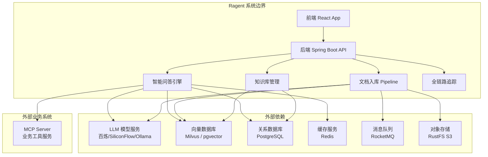

**协作关系说明**：
- **LLM 模型服务**：提供对话生成、Embedding 向量化、Rerank 重排序、意图识别等 AI 能力
- **向量数据库（Milvus / pgvector）**：存储文档分块的向量表示，支持相似度检索
- **PostgreSQL**：存储所有业务数据（用户、会话、知识库、文档、意图树、追踪记录等）
- **Redis**：缓存意图树、会话记忆、分布式锁、排队限流
- **RocketMQ**：异步处理文档分块入库、消息反馈等任务
- **RustFS（S3 兼容）**：存储上传的原始文档文件
- **MCP Server**：独立部署的业务工具服务，当用户意图为非知识检索时自动调用

---

## 2. 关键业务概念

### 2.1 核心术语表

| 术语 | 业务含义 | 技术实现 |
|------|---------|---------|
| **Knowledge Base（知识库）** | 一组相关文档的逻辑集合，如"人事制度库"、"IT支持库" | `t_knowledge_base` 表 + Milvus/pgvector Collection |
| **Document（文档）** | 知识库中的单个文件，如一份 PDF 手册 | `t_knowledge_document` 表 + S3 文件存储 |
| **Chunk（分块）** | 文档被切分后的文本片段，是检索的最小单位 | `t_knowledge_chunk` 表 + 向量数据库中的向量记录 |
| **Embedding（向量嵌入）** | 将文本转换为高维浮点数向量的过程 | `EmbeddingService` → 调用 Embedding 模型 API |
| **Intent Tree（意图树）** | 三级树形意图分类体系：Domain → Category → Topic | `t_intent_node` 表，树形结构存储 |
| **Intent Node（意图节点）** | 意图树的叶子节点，关联知识库或 MCP 工具 | `IntentNode` 实体，包含 `kind`（KB/MCP/SYSTEM）|
| **Query Rewrite（问题重写）** | 将用户原始问题改写为适合检索的查询 | `MultiQuestionRewriteService`，LLM 辅助改写 |
| **Multi-Channel Retrieval（多通道检索）** | 多种检索策略并行执行后合并结果 | `MultiChannelRetrievalEngine`，策略模式 |
| **Search Channel（检索通道）** | 单一检索策略的实现，如向量全局检索、意图定向检索 | `SearchChannel` 接口的不同实现 |
| **Post Processor（后处理器）** | 对检索结果进行去重、重排序等后处理 | `SearchResultPostProcessor` 接口 |
| **Rerank（重排序）** | 使用专用模型对检索结果进行精排 | `RerankService` → 调用 Rerank 模型 API |
| **MCP Tool（MCP 工具）** | 通过 MCP 协议调用的外部业务工具 | `MCPToolExecutor` 接口，如天气查询、工单查询 |
| **Conversation Memory（会话记忆）** | 多轮对话的上下文管理机制 | 滑动窗口 + LLM 摘要压缩 |
| **Model Routing（模型路由）** | 在多个模型候选之间进行优先级调度和故障转移 | `RoutingLLMService` + `ModelRoutingExecutor` |
| **Circuit Breaker（熔断器）** | 三态熔断机制（CLOSED→OPEN→HALF_OPEN） | `ModelHealthStore`，每个模型独立维护 |
| **Ingestion Pipeline（入库流水线）** | 文档从上传到可检索的处理链路 | `IngestionEngine` + 节点编排 |
| **RAG Trace（链路追踪）** | 记录每次问答的全链路执行信息 | `@RagTraceNode` AOP + `t_rag_trace_run/node` 表 |
| **Probe Stream Bridge（首包探测）** | 流式输出时缓冲首包，确保模型切换用户无感知 | `ProbeStreamBridge` 装饰器模式 |

### 2.2 概念关联关系

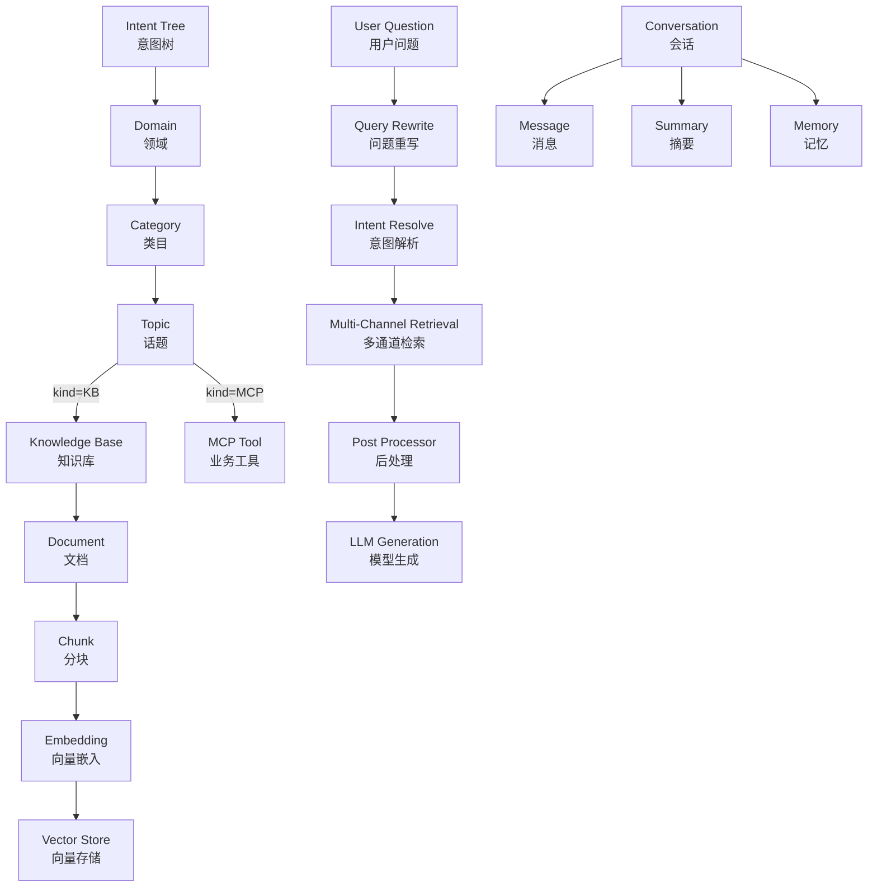

### 2.3 概念应用示例

**场景：用户提问"Mac电脑打印机怎么连？加班到凌晨第二天可以几点到？"**

1. **问题重写**：LLM 将问题改写并拆分为两个子问题：
   - "Mac电脑连接打印机的方法"
   - "加班到凌晨后第二天的上班时间"

2. **意图识别**：对每个子问题进行意图分类：
   - 子问题1 → 命中意图节点 `IT_SUPPORT > 打印机` (kind=KB, score=0.92)
   - 子问题2 → 命中意图节点 `HR > 考勤制度` (kind=KB, score=0.88)

3. **多通道检索**：
   - **意图定向通道**：分别在 `rag_it_collection` 和 `rag_hr_collection` 中检索
   - **向量全局通道**：如果意图置信度 < 0.6，额外在全局知识库中检索兜底

4. **后处理**：去重 → Rerank 重排序 → 取 Top-K

5. **Prompt 组装 + 流式生成**：将检索结果注入 Prompt，调用 LLM 生成回答并通过 SSE 流式推送

---

## 3. 核心业务流程

### 3.1 智能问答流程

这是 Ragent 最核心的业务流程，完整链路如下：

```
用户提问
    ↓
【限流排队】ChatQueueLimiter（Redis ZSET + 信号量）
    ↓
【记忆加载】ConversationMemoryService
    ├─ 并行加载摘要（ConversationSummary）
    └─ 并行加载近 N 轮历史消息
    ↓
【问题重写与拆分】QueryRewriteService
    ├─ 关键词归一化（QueryTermMappingService）
    ├─ LLM 改写（去除礼貌用语、补全指代词）
    └─ 多问句拆分（按问号/分号/列举拆分）
    ↓
【意图解析】IntentResolver
    ├─ 对每个子问题并行调用 IntentClassifier
    ├─ 过滤低分意图（score < 0.35）
    └─ 限制总意图数（≤ 3）
    ↓
【歧义引导】IntentGuidanceService
    ├─ 检测是否存在歧义（置信度不足）
    └─ 如有歧义 → 返回引导提示，流程终止
    ↓
【分支判断】
    ├─ 全部为 SYSTEM 意图 → 直接调用 LLM（无检索）
    └─ 包含 KB/MCP 意图 → 进入检索流程
    ↓
【检索引擎】RetrievalEngine
    ├─ 并行处理每个子问题
    │   ├─ KB 意图 → MultiChannelRetrievalEngine
    │   │   ├─ IntentDirectedSearchChannel（意图定向检索）
    │   │   └─ VectorGlobalSearchChannel（全局向量检索，条件触发）
    │   │   ↓
    │   │   【后处理器链】
    │   │   ├─ DeduplicationPostProcessor（去重）
    │   │   └─ RerankPostProcessor（Rerank 重排序）
    │   └─ MCP 意图 → MCPToolExecutor（调用业务工具）
    └─ 合并所有子问题的检索结果
    ↓
【Prompt 组装】RAGPromptService
    ├─ 根据意图类型选择 Prompt 模板
    │   ├─ answer-chat-kb.st（纯知识库场景）
    │   ├─ answer-chat-mcp.st（纯 MCP 场景）
    │   └─ answer-chat-mcp-kb-mixed.st（混合场景）
    └─ 注入检索上下文、历史消息、子问题
    ↓
【流式输出】RoutingLLMService
    ├─ ModelSelector 选择模型候选列表
    ├─ ProbeStreamBridge 首包探测缓冲
    ├─ 模型调用失败 → 自动降级到下一候选
    └─ SSE 实时推送到前端
    ↓
【异步后处理】
    ├─ 保存 Assistant 消息到数据库
    ├─ 触发会话摘要压缩（如超过阈值）
    └─ 记录 RAG Trace 信息
```

**关键决策点**：

| 决策点 | 条件 | 行为 |
|-------|------|------|
| 是否启用问题重写 | `rag.query-rewrite.enabled` | 关闭时仅做关键词归一化 |
| 是否触发全局检索 | 意图置信度 < `confidence-threshold`（默认 0.6） | 低于阈值时同时执行全局检索兜底 |
| 是否返回歧义引导 | `GuidanceDecision.isPrompt()` | 置信度不足时主动引导用户澄清 |
| 是否走 SYSTEM 分支 | 所有意图均为 SYSTEM 类型 | 跳过检索，直接调用 LLM |
| 检索结果为空 | `ctx.isEmpty()` | 返回"未检索到相关文档"提示 |
| 模型调用失败 | 当前模型异常 | 标记失败 → 熔断 → 降级到下一候选模型 |

### 3.2 文档入库流程

文档入库支持两种模式：**Chunk 模式**（默认）和 **Pipeline 模式**（可编排）。

#### 3.2.1 Chunk 模式（默认）

```
文档上传
    ↓
【文件存储】上传到 RustFS（S3 兼容存储）
    ↓
【发送 MQ 消息】RocketMQ 事务消息
    ↓
【消费者处理】KnowledgeDocumentChunkConsumer
    ├─ 文档解析（Apache Tika / Markdown Parser）
    ├─ 文本分块（固定大小 / 文本边界 / 递归字符 / 语义分块）
    ├─ 向量化（调用 Embedding 模型）
    └─ 写入向量数据库 + 关系数据库
```

#### 3.2.2 Pipeline 模式（可编排）

```
文档上传（指定 Pipeline ID）
    ↓
【IngestionEngine 执行流水线】
    ├─ FetcherNode（获取文档）
    │   └─ 支持本地文件 / URL 远程抓取
    ├─ ParserNode（解析文档）
    │   └─ Tika 解析 / Markdown 解析
    ├─ EnhancerNode（AI 增强）
    │   └─ LLM 对文本进行质量增强
    ├─ EnricherNode（内容丰富）
    │   └─ 提取关键词、生成问题
    ├─ ChunkerNode（文本分块）
    │   └─ 按配置的分块策略切分
    └─ IndexerNode（向量化写入）
        └─ Embedding + 写入向量数据库
```

每个节点支持：
- **条件执行**：通过 `condition_json` 配置是否执行
- **链式传递**：通过 `next_node_id` 指定下一节点
- **独立日志**：每个节点的执行状态、耗时、错误信息均有记录

### 3.3 会话记忆管理流程

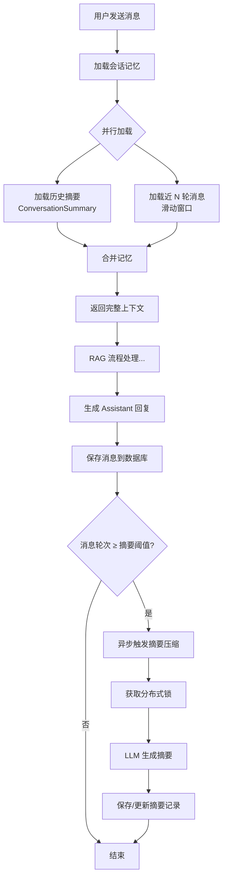

**关键配置参数**：

| 参数 | 默认值 | 说明 |
|------|-------|------|
| `rag.memory.history-keep-turns` | 4 | 保留最近 N 轮对话 |
| `rag.memory.summary-start-turns` | 5 | 超过此轮次触发摘要 |
| `rag.memory.summary-enabled` | true | 是否启用摘要压缩 |
| `rag.memory.ttl-minutes` | 60 | 记忆缓存 TTL |
| `rag.memory.summary-max-chars` | 200 | 摘要最大字符数 |

### 3.4 模型路由与容错流程

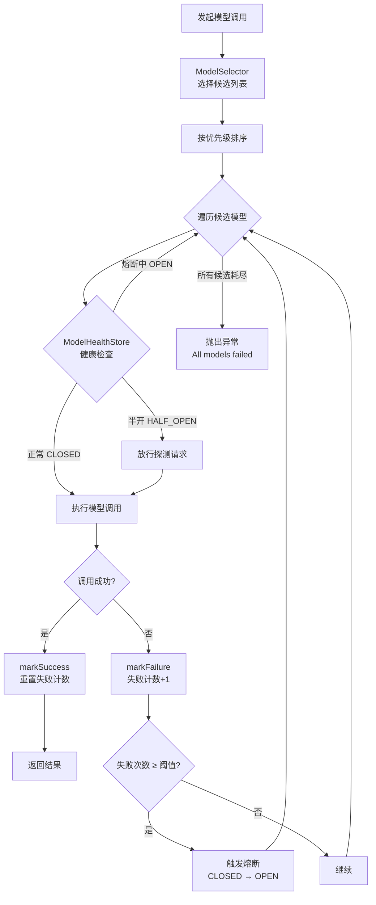

**熔断器三态转换**：

| 状态 | 行为 | 转换条件 |
|------|------|---------|
| **CLOSED**（关闭） | 正常放行所有请求 | 失败次数 ≥ `failure-threshold`（默认 2）→ OPEN |
| **OPEN**（打开） | 拒绝所有请求 | 冷却时间 ≥ `open-duration-ms`（默认 30s）→ HALF_OPEN |
| **HALF_OPEN**（半开） | 放行一个探测请求 | 探测成功 → CLOSED；探测失败 → OPEN |

---

## 4. 接口逻辑时序图

### 4.1 流式问答接口

**接口**：`GET /api/ragent/rag/v3/chat`

**参数**：
- `question`（必填）：用户问题
- `conversationId`（可选）：会话 ID，空时创建新会话
- `deepThinking`（可选）：是否开启深度思考模式，默认 false

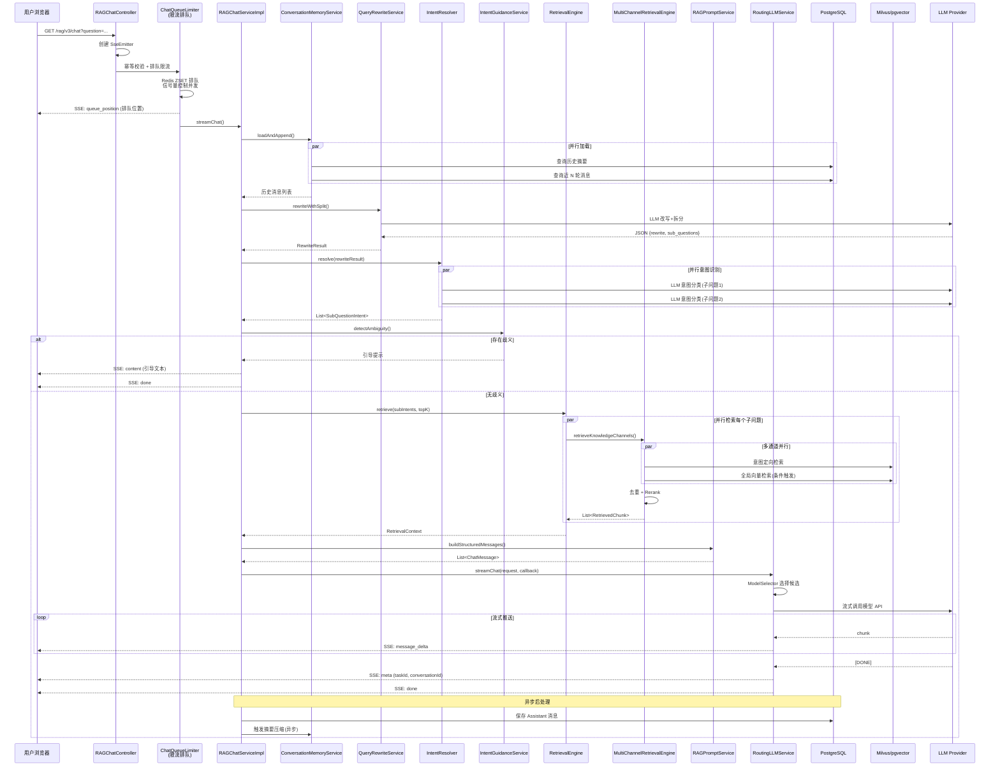

### 4.2 文档上传与入库接口

**接口**：`POST /api/ragent/knowledge/documents/upload`

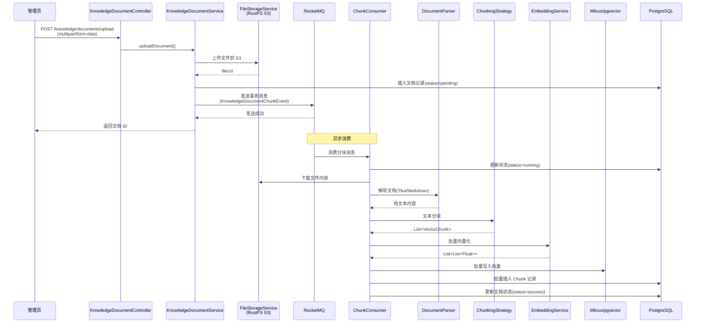

### 4.3 知识库管理接口

**接口列表**：

| 方法 | 路径 | 说明 |
|------|------|------|
| `POST` | `/knowledge/bases` | 创建知识库 |
| `GET` | `/knowledge/bases` | 分页查询知识库 |
| `DELETE` | `/knowledge/bases/{id}` | 删除知识库 |
| `POST` | `/knowledge/documents/upload` | 上传文档 |
| `GET` | `/knowledge/documents` | 分页查询文档 |
| `PUT` | `/knowledge/documents/{id}` | 更新文档 |
| `DELETE` | `/knowledge/documents/{id}` | 删除文档 |
| `GET` | `/knowledge/chunks` | 分页查询分块 |
| `POST` | `/knowledge/chunks` | 手动创建分块 |
| `PUT` | `/knowledge/chunks/{id}` | 更新分块 |
| `DELETE` | `/knowledge/chunks/{id}` | 删除分块 |

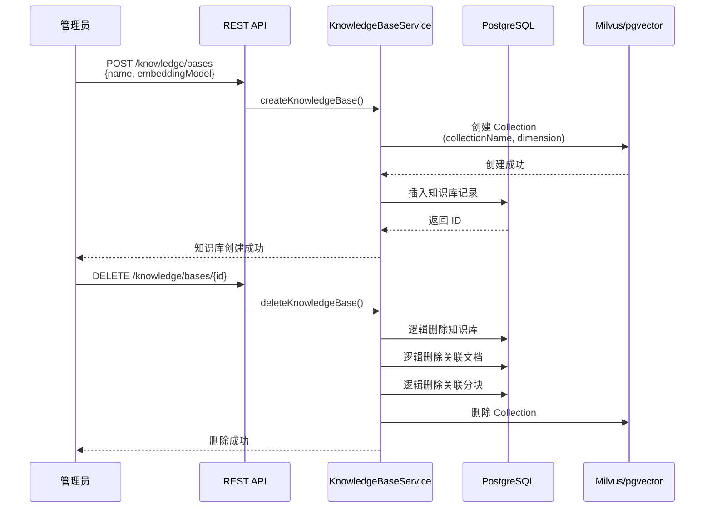

---

## 5. 系统架构图

### 5.1 整体架构

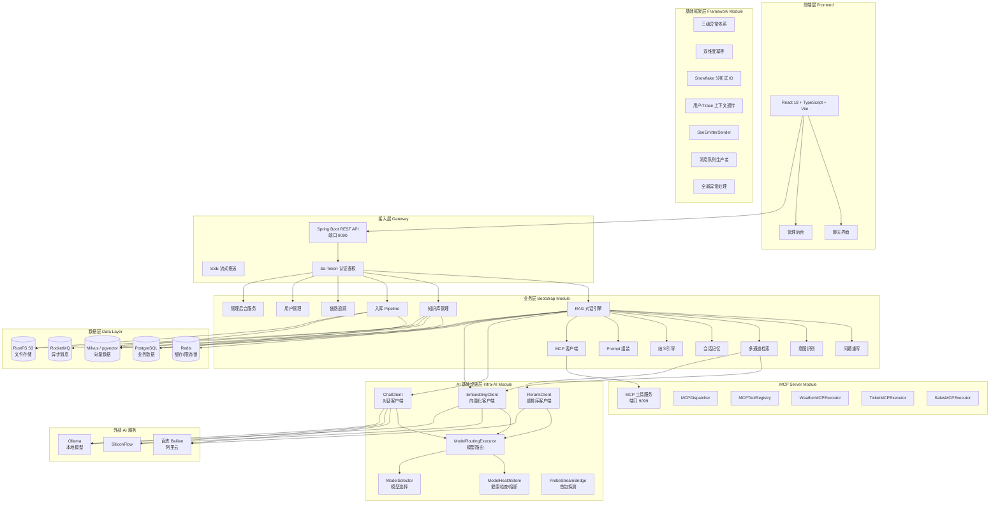

### 5.2 模块分层架构

Ragent 后端采用四个 Maven 模块的分层架构：

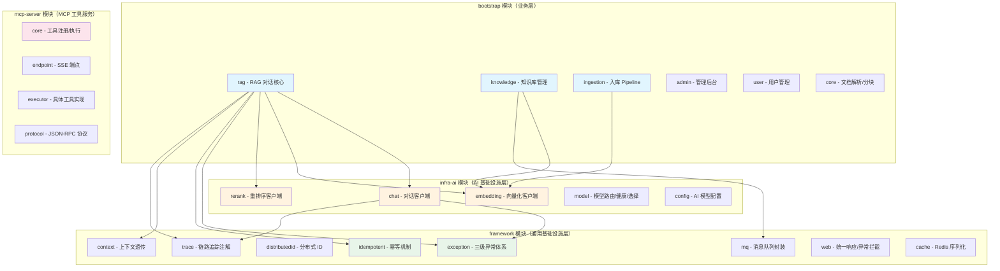

**分层原则**：
- **bootstrap**：专注业务逻辑，依赖 infra-ai 和 framework
- **infra-ai**：屏蔽不同模型供应商的差异，换供应商不改业务代码
- **framework**：与业务无关的通用能力，可独立复用
- **mcp-server**：独立部署的 MCP 工具服务，通过 HTTP 与主服务通信

### 5.3 技术栈选型

| 层面 | 技术选型 | 版本 | 选型理由 |
|------|---------|------|---------|
| 后端框架 | Java + Spring Boot | 17 / 3.5.7 | 企业级主流技术栈，生态成熟 |
| 前端框架 | React + TypeScript + Vite | 18 | 现代化前端方案，类型安全 |
| ORM | MyBatis Plus | 3.5.14 | 简化 CRUD，支持分页和代码生成 |
| 关系数据库 | PostgreSQL | - | 支持 pgvector 扩展，可同时作为向量数据库 |
| 向量数据库 | Milvus / pgvector | 2.6.x | 可选部署，Milvus 适合大规模，pgvector 轻量 |
| 缓存 | Redis + Redisson | 4.0.0 | 分布式锁、限流排队、意图树缓存 |
| 消息队列 | RocketMQ | 5.x | 事务消息保证文档入库的可靠性 |
| 对象存储 | RustFS（S3 兼容） | - | 轻量级 S3 兼容存储，存储上传文档 |
| 文档解析 | Apache Tika | 3.2.3 | 支持 PDF/Word/PPT 等多种格式 |
| 认证鉴权 | Sa-Token | 1.43.0 | 轻量级 Java 权限认证框架 |
| 上下文透传 | TransmittableThreadLocal | 2.14.5 | 跨线程池的用户上下文和 Trace 上下文透传 |
| 代码规范 | Spotless | 2.22.1 | 编译时自动格式化，统一代码风格 |
| AI 供应商 | 百炼 / SiliconFlow / Ollama | - | 多供应商支持，可本地部署 |

---

## 6. 数据模型设计

### 6.1 数据表总览

Ragent 共设计了 **20 张业务表**，按业务域划分为 5 个模块：

| 业务域 | 表名 | 说明 |
|-------|------|------|
| **用户与会话** | `t_user` | 系统用户表 |
| | `t_conversation` | 会话列表 |
| | `t_conversation_summary` | 会话摘要表 |
| | `t_message` | 会话消息记录表 |
| | `t_message_feedback` | 消息反馈表（点赞/点踩） |
| | `t_sample_question` | 示例问题表 |
| **知识库** | `t_knowledge_base` | 知识库表 |
| | `t_knowledge_document` | 知识库文档表 |
| | `t_knowledge_chunk` | 文档分块表 |
| | `t_knowledge_document_chunk_log` | 分块日志表 |
| | `t_knowledge_document_schedule` | 文档定时刷新任务表 |
| | `t_knowledge_document_schedule_exec` | 定时刷新执行记录 |
| | `t_knowledge_vector` | 向量存储表（pgvector） |
| **意图与查询** | `t_intent_node` | 意图树节点配置表 |
| | `t_query_term_mapping` | 关键词归一化映射表 |
| **链路追踪** | `t_rag_trace_run` | Trace 运行记录表 |
| | `t_rag_trace_node` | Trace 节点记录表 |
| **入库流水线** | `t_ingestion_pipeline` | 摄取流水线表 |
| | `t_ingestion_pipeline_node` | 流水线节点表 |
| | `t_ingestion_task` | 摄取任务表 |
| | `t_ingestion_task_node` | 任务节点执行记录表 |

### 6.2 核心表结构

#### 6.2.1 用户与会话域

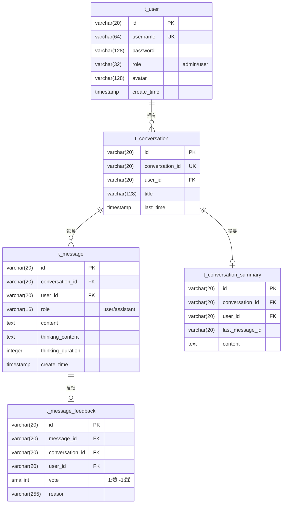

#### 6.2.2 知识库域

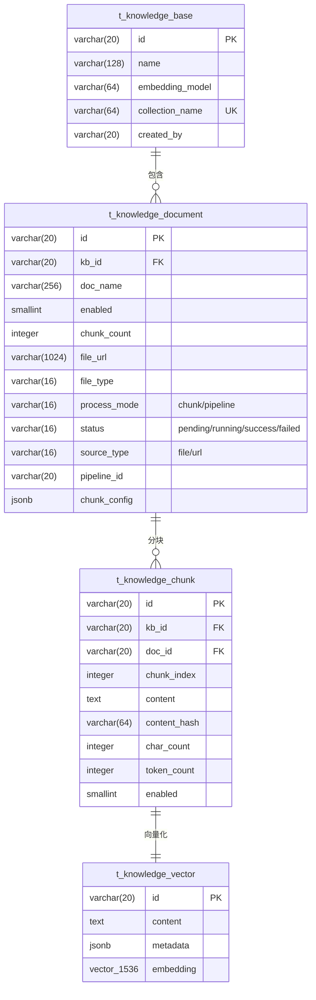

#### 6.2.3 意图树域

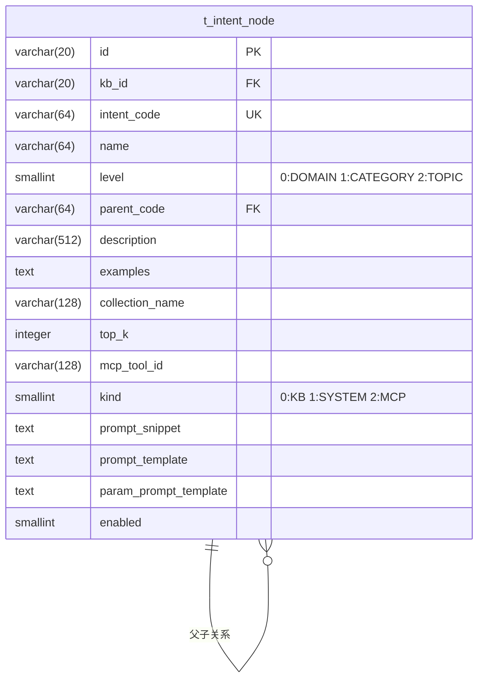

### 6.3 数据关联关系

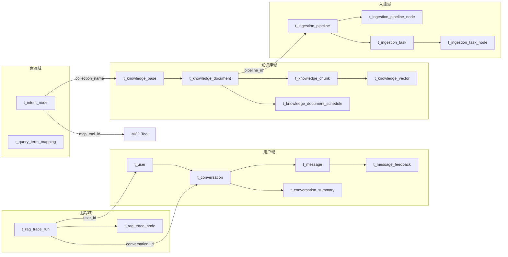

### 6.4 数据访问模式

| 访问场景 | 查询模式 | 索引策略 |
|---------|---------|---------|
| 用户会话列表 | 按 `user_id` + `last_time` 降序 | `idx_user_time` 复合索引 |
| 会话消息加载 | 按 `conversation_id` + `user_id` + `create_time` | `idx_conversation_user_time` 复合索引 |
| 知识库文档列表 | 按 `kb_id` 查询 | `idx_kb_id` 索引 |
| 文档分块查询 | 按 `doc_id` 查询 | `idx_doc_id` 索引 |
| 向量相似度检索 | 按 `embedding` 余弦相似度 | `idx_kv_embedding` HNSW 索引 |
| 向量元数据过滤 | 按 `metadata` JSONB 字段 | `idx_kv_metadata` GIN 索引 |
| 链路追踪查询 | 按 `trace_id` 或 `user_id` | `uk_run_id` 唯一索引 + `idx_user_id_trace` |
| 定时任务扫描 | 按 `next_run_time` 扫描 | `idx_next_run` 索引 |

**数据一致性保障**：
- **文档入库**：通过 RocketMQ 事务消息保证文件上传与分块入库的最终一致性
- **向量与关系数据同步**：在同一事务中完成 Chunk 记录插入和向量写入
- **分布式锁**：使用 Redisson 分布式锁保证会话摘要压缩的幂等性
- **逻辑删除**：所有业务表均采用 `deleted` 字段的逻辑删除策略

---

## 7. 部署和运维说明

### 7.1 部署环境要求

| 组件 | 最低要求 | 推荐配置 |
|------|---------|---------|
| JDK | 17+ | 17 LTS |
| Node.js | 18+ | 20 LTS |
| PostgreSQL | 14+ | 16（需安装 pgvector 扩展） |
| Redis | 6+ | 7.x |
| RocketMQ | 5.x | 5.2.0 |
| Milvus（可选） | 2.5+ | 2.6.6 |
| RustFS | 1.0+ | 1.0.0-alpha.72 |
| 内存 | 4GB | 8GB+ |
| CPU | 2 核 | 4 核+ |

### 7.2 依赖服务部署

#### 7.2.1 Milvus + RustFS 一键部署

项目提供了 Docker Compose 配置文件：

```bash
# 部署 Milvus 向量数据库 + RustFS 对象存储 + Attu 管理界面
docker compose -f resources/docker/milvus-stack-2.6.6.compose.yaml up -d
```

该配置包含：
- **RustFS**：S3 兼容对象存储（端口 9000/9001）
- **etcd**：Milvus 元数据存储
- **Milvus Standalone**：向量数据库（端口 19530）
- **Attu**：Milvus 可视化管理界面（端口 8000）

#### 7.2.2 RocketMQ 部署

```bash
# 部署 RocketMQ（ARM 架构使用 amd 版本）
docker compose -f resources/docker/rocketmq-stack-5.2.0.compose.yaml up -d
```

#### 7.2.3 轻量级部署（pgvector 替代 Milvus）

如果不需要 Milvus，可以使用 PostgreSQL 的 pgvector 扩展：

```yaml
# application.yaml 配置
rag:
  vector:
    type: pg  # 使用 pgvector 替代 Milvus
```

```bash
# 轻量级部署（仅 RustFS）
docker compose -f resources/docker/lightweight/milvus-stack-2.6.6.compose.yaml up -d
```

#### 7.2.4 数据库初始化

```bash
# 执行 Schema 创建脚本
psql -U postgres -d ragent -f resources/database/schema_pg.sql

# 执行初始数据脚本
psql -U postgres -d ragent -f resources/database/init_data_pg.sql
```

### 7.3 应用配置说明

核心配置文件位于 `bootstrap/src/main/resources/application.yaml`：

#### 7.3.1 服务基础配置

```yaml
server:
  port: 9090
  servlet:
    context-path: /api/ragent

spring:
  servlet:
    multipart:
      max-file-size: 50MB      # 单文件最大 50MB
      max-request-size: 100MB   # 请求最大 100MB
```

#### 7.3.2 AI 模型配置

```yaml
ai:
  providers:
    bailian:                    # 百炼（阿里云）
      url: https://dashscope.aliyuncs.com
      api-key: ${BAILIAN_API_KEY:}
    siliconflow:                # SiliconFlow
      url: https://api.siliconflow.cn
      api-key: ${SILICONFLOW_API_KEY:}
    ollama:                     # Ollama（本地）
      url: http://localhost:11434

  chat:
    default-model: qwen3-max
    candidates:                 # 按 priority 排序，数值越小优先级越高
      - id: qwen-plus
        provider: bailian
        priority: 1
      - id: qwen3-max
        provider: bailian
        supports-thinking: true
        priority: 3

  selection:
    failure-threshold: 2        # 失败 2 次触发熔断
    open-duration-ms: 30000     # 熔断持续 30 秒
```

#### 7.3.3 RAG 核心配置

```yaml
rag:
  vector:
    type: pg                    # 向量存储类型：milvus / pg

  query-rewrite:
    enabled: true               # 是否启用问题重写
    max-history-messages: 4     # 重写时参考的历史消息数

  rate-limit:
    global:
      max-concurrent: 1         # 全局最大并发数
      max-wait-seconds: 3       # 最大排队等待时间
      lease-seconds: 30         # 许可租约时间

  memory:
    history-keep-turns: 4       # 保留最近 4 轮对话
    summary-start-turns: 5      # 超过 5 轮触发摘要
    summary-max-chars: 200      # 摘要最大字符数

  search:
    channels:
      vector-global:
        confidence-threshold: 0.6  # 意图置信度低于此值启用全局检索
      intent-directed:
        min-intent-score: 0.4      # 意图最低分数阈值

  mcp:
    servers:
      - name: default
        url: http://localhost:9099  # MCP Server 地址
```

### 7.4 监控与告警

#### 7.4.1 全链路追踪

Ragent 内置了基于 AOP 的全链路追踪系统，通过 `@RagTraceNode` 注解自动记录每个环节的执行信息：

```
追踪记录包含：
├─ trace_id：全局链路 ID
├─ 入口方法、会话 ID、用户 ID
├─ 各节点执行信息：
│   ├─ query-rewrite（问题重写）：耗时、输入输出
│   ├─ intent-resolve（意图解析）：耗时、识别结果
│   ├─ multi-channel-retrieval（多通道检索）：耗时、检索数量
│   ├─ retrieval-engine（检索引擎）：耗时、上下文大小
│   └─ llm-chat-routing（模型路由）：耗时、选用模型
└─ 总耗时、最终状态（SUCCESS/ERROR）
```

管理员可通过管理后台的 **链路追踪** 页面查看每次问答的完整执行链路。

#### 7.4.2 关键监控指标

| 指标 | 说明 | 关注阈值 |
|------|------|---------|
| 问答总耗时 | 从接收请求到首包返回 | > 10s 需关注 |
| 意图识别耗时 | LLM 意图分类耗时 | > 3s 需关注 |
| 检索耗时 | 向量检索 + Rerank 耗时 | > 2s 需关注 |
| 模型首包时间 | 流式输出首个 Token 的时间 | > 5s 需关注 |
| 模型熔断次数 | 模型被熔断的频率 | 频繁熔断需检查模型服务 |
| 排队等待时间 | 用户在限流队列中的等待时间 | > 3s 影响体验 |
| 文档入库成功率 | 文档分块入库的成功比例 | < 95% 需排查 |

#### 7.4.3 日志规范

系统日志按模块和级别输出，关键日志标识：

```
[RAG] 开始流式对话，会话ID：xxx，任务ID：xxx
[REWRITE] 查询改写+拆分：原始问题 → 改写结果 → 子问题列表
[INTENT] 意图识别结果：节点名称、分数、类型
[RETRIEVE] 多通道检索统计 - 总通道数、有结果数、Chunk 总数
[MODEL] 模型调用失败，fallback to next. modelId=xxx
[MEMORY] 对话摘要生成 - resultChars: xxx
```

### 7.5 常见故障排查

#### 7.5.1 模型调用失败

**现象**：用户提问后返回"大模型调用失败，请稍后再试"

**排查步骤**：
1. 检查 AI 模型服务是否可达：`curl https://dashscope.aliyuncs.com/compatible-mode/v1/chat/completions`
2. 检查 API Key 是否配置正确：环境变量 `BAILIAN_API_KEY`、`SILICONFLOW_API_KEY`
3. 查看日志中的模型熔断记录：搜索 `model failed, fallback to next`
4. 如果所有模型都熔断，等待冷却期（默认 30s）后自动恢复

#### 7.5.2 检索结果为空

**现象**：用户提问后返回"未检索到与问题相关的文档内容"

**排查步骤**：
1. 确认知识库中有相关文档且状态为 `success`
2. 检查文档分块是否正常：查看 `t_knowledge_chunk` 表
3. 检查向量数据库中是否有对应向量：通过 Attu 管理界面查看
4. 检查意图树配置：确认意图节点关联了正确的 `collection_name`
5. 调整检索阈值：降低 `confidence-threshold` 或 `min-intent-score`

#### 7.5.3 文档入库失败

**现象**：文档上传后状态一直为 `pending` 或变为 `failed`

**排查步骤**：
1. 检查 RocketMQ 是否正常运行：`telnet 127.0.0.1 9876`
2. 检查消费者日志：搜索 `KnowledgeDocumentChunkConsumer`
3. 检查文件是否成功上传到 S3：通过 RustFS 控制台查看
4. 检查 Embedding 模型是否可用：搜索 `embedding` 相关错误日志
5. 查看分块日志表 `t_knowledge_document_chunk_log` 中的错误信息

#### 7.5.4 SSE 连接断开

**现象**：流式回答中途断开

**排查步骤**：
1. 检查 Nginx/网关的超时配置：SSE 需要较长的连接保持时间
2. 检查 `SseEmitter` 超时设置：当前设置为 `0L`（无超时）
3. 检查网络代理是否支持 SSE：部分代理会缓冲 SSE 事件
4. 查看日志中是否有 `流式请求被中断` 或 `流式首包超时` 的记录

#### 7.5.5 并发限流问题

**现象**：用户提问后一直处于排队状态

**排查步骤**：
1. 检查 Redis 连接是否正常
2. 查看当前排队情况：Redis 中的 ZSET 键
3. 检查是否有许可泄漏：`lease-seconds` 过期后应自动释放
4. 调整限流参数：增大 `max-concurrent` 或 `max-wait-seconds`

---

> **文档维护说明**：本文档基于代码仓库实际实现状态自动生成，如有更新请同步修改。建议在每次重大版本发布时更新本文档。
